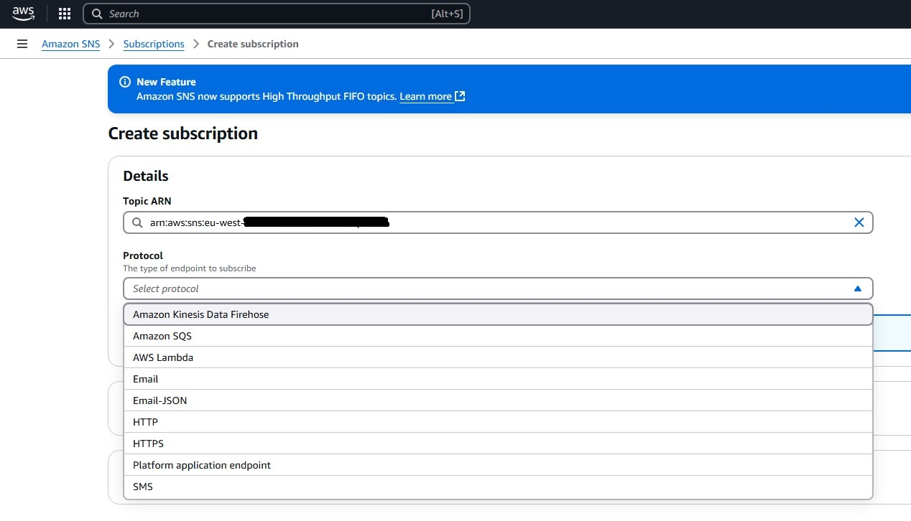
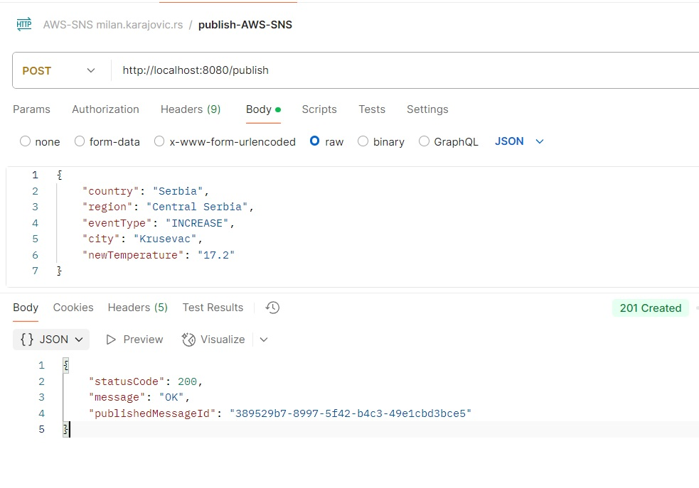
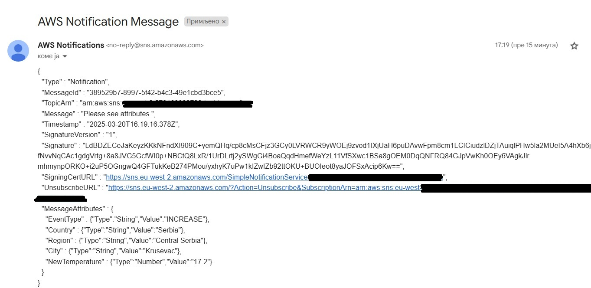
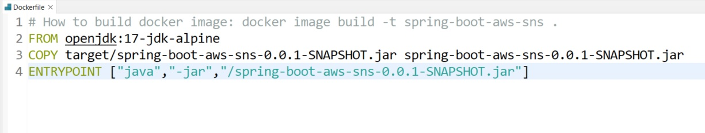
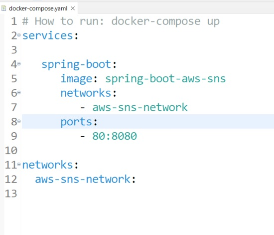
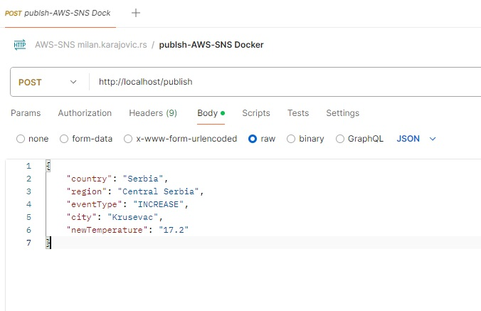

# AWS SNS with Spring Boot and Email as subscriber
Example Send message from Spring Boot application using AWS SNS (Simpe Notification Service) and email as subscriber


## Author

- **Milan Karajović**
- **email:** milan.karajovic.rs@gmail.com
- **Portfolio:** [https://milan.karajovic.rs](https://milan.karajovic.rs/)


## Tech Stack

**Server:** 
- Java 17, 
- Spring Boot 3.1.1, 
- SNS Amazon-AWSSDK
- JPA
- Maven
- Lombok
- JUnit

**AWS:**
- IAM
- SNS (Simple Notification Service)

## Introduction
The concepts of "topic" and "subscribe" are often linked, especially in contexts like messaging systems, event-driven architectures, or content platforms.
- **Publisher**: This is the source or entity that produces messages or events. The publisher doesn't need to know who will consume its messages.
- **Topic**: This acts as a channel or intermediary that categorizes messages. Publishers post messages to specific topics, and subscribers listen to those topics. It's used in systems like message brokers (e.g., RabbitMQ, AWS SNS, Apache Kafka) to allow publishers to send messages without worrying about who will receive them.
- **Subscriber**: These are the entities that consume the messages from the topics they're interested in. Subscribers can dynamically choose topics to receive only the information they need.

## Amazon SNS (Simple Notification Service) topic

Amazon SNS provides message delivery from publishers to subscribers using the pub/sub pattern. Publishers send messages to an SNS topic, and subscribers receive those messages through their chosen endpoints.
**Topic Types**: SNS supports two types of topics:
- Standard Topics: Allow high throughput and best-effort message ordering at least one message delivery
- FIFO Topics: Ensure message order and exactly-once message delivery.
Subscribers can be other applications, an Amazon SQS queue, AWS lambda function, or HTTPS endpoint… We can see that in the picture bellow:



## Create Topic and Subscribe on the topic
**Create User in IAM**
- On the AWS dashboard choose service IAM (Manage access to AWS resources)
- Create user or use existed user
	- For created user add for Permission policies: AmazonSNSFullAccess
	- On the card Security credentials, you can see option Access Keyes
		- Press Create access key - go to the process where you will create user_accessKeys.csv. In this file, you can see Access key ID and Secret access key. These values you will use in the spring Boot application, in the file: AppListener.java(/spring-boot-aws-sns/src/main/java/rs/karajovic/milan/config/AppListener.java)
		
**Create topic in Amazon SNS**
- On the AWS dashboard choose Amazon SNS (Simple Notification Service)
- Go to link Topics 
	- Create topic
		- Standard
		- Give name for topic
		- Create topic
		
**Subscribe on the topic**
- Go to link Topics
	- Choose created topic
		- Create subscription
			- There you can see Topic ARN
			- Also, you can see different protocols: Amazon Kinesis Data Firehose, Amazon SQS, AWS Lambda, Email, Email-JSON, HTTP, HTTPS, Platform application endpoint, SMS. For our demo, we will choose: **Email-JSON**
- When you choose Topics, and click on your topic, you can see fields: Name and ARN. Content of these fields you will use in the project, in the file: application.properties (/spring-boot-aws-sns/src/main/resources/application.properties)

## Implementation
Create spring Boot applciation using Spring Initializr using specific dependencies which are shown in the pom.xml
- lombok
- spring-boot-starter-web
- spring-boot-starter-validation
- spring-boot-starter-actuator
- validation-api
- spring-boot-starter-test
- sns
- spring-boot-configuration-processor

**Allow the application to connect to AWS**

Create application listener in which is need to set up an AWS access key and secret key in the Java system properties, so the app is able to connect to AWS. We got these properties in the step of creating a context in IAM, which was explained in the step before.

```java
public class AppListener implements ApplicationListener<ApplicationEnvironmentPreparedEvent> {

// accessKeyId & for AWS user
private final String AWS_ACCESSKEYID = "YOUR_ACCESSKEYID";
// secretAccessKey for AWS user
private final String AWS_SECRETACCESSKEY = "YOUR_SECRETACCESSKEY";

  @Override
  public void onApplicationEvent(ApplicationEnvironmentPreparedEvent applicationEnvironmentPreparedEvent) {
    
      System.setProperty("aws.accessKeyId", AWS_ACCESSKEYID);
      System.setProperty("aws.secretAccessKey", AWS_SECRETACCESSKEY);
    
  }
}
```

**Allow the application to connect to AWS**

Create application listener in which is need to set up an AWS access key and secret key in the Java system properties, so the app is able to connect to AWS. We got these properties in the step of creating a context in IAM, which was explained in the step before.

```java
public class AppListener implements ApplicationListener<ApplicationEnvironmentPreparedEvent> {

// accessKeyId & for AWS user
private final String AWS_ACCESSKEYID = "YOUR_ACCESSKEYID";
// secretAccessKey for AWS user
private final String AWS_SECRETACCESSKEY = "YOUR_SECRETACCESSKEY";

  @Override
  public void onApplicationEvent(ApplicationEnvironmentPreparedEvent applicationEnvironmentPreparedEvent) {
    
      System.setProperty("aws.accessKeyId", AWS_ACCESSKEYID);
      System.setProperty("aws.secretAccessKey", AWS_SECRETACCESSKEY);
    
  }
}
```

Applicaton listener should be added to the application.

```java
@SpringBootApplication
public class SpringBootAwsSns {

  public static void main(String[] args) {
      SpringApplication app = new SpringApplication(SpringBootAwsSns.class);
      app.addListeners(new AppListener());
      app.run(args);
  }
  
}
```

**Set up SNS properties**
In application.properties set values for aws-sns region and topicArn. We got these properties in the step of creating topic in Amazon SNS, which was explained in the step before.

```java
#### AWS - SNS ### -
aws.sns.region=fill with region where you crated sns
aws.sns.topicArn=fill with created arn for test-top-arn
```

**Configuation SNS Client**

Now we need to configure the SNS Client that will publish messages to the topic. We created a class that reads the AWS SNS properties from the properties file. It is in the class /spring-boot-aws-sns/src/main/java/rs/karajovic/milan/config/AwsProperties.java.

```java
import lombok.Getter;
import lombok.Setter;

import javax.validation.constraints.NotNull;

@Configuration
@ConfigurationProperties(prefix = "aws.sns")
public class AwsProperties {

    @Getter @Setter
    @NotNull
    private String region;

    @Getter @Setter
    @NotNull
    private String topicArn;

}
```

Then, configure an SNS Client with the appropriate region.

```java
@Configuration
public class SnsConfig {

  @Autowired
  private AwsProperties awsProperties;

  @Bean
  public SnsClient snsClient() {
      return SnsClient.builder()
              .region(Region.of(awsProperties.getRegion()))
              .build();
  }
}
```

**Build a message with a message attributes**

In our scenario, subscribers to the topic wish to receive notifications about changes in temperature, whether it increases or decreases. Create the Message class to specify the attributes that are relevant to these subscribers.

```java
@Configuration
public class SnsConfig {

  @Autowired
  private AwsProperties awsProperties;

  @Bean
  public SnsClient snsClient() {
      return SnsClient.builder()
              .region(Region.of(awsProperties.getRegion()))
              .build();
  }
}
```

```java
public enum EventType {
  DROP, INCREASE
}
```

Next, we create a builder that constructs an Amazon PublishRequest object from a given message. This message leverages Amazon SNS message attributes, which allow for greater flexibility. One key advantage of using these attributes is that they enable subscribers to filter their subscriptions based on specific attributes, ensuring they only receive the notifications that are relevant to their interests.

```java
public class RequestBuilder {
  public static final String COUNTRY = "Country";
  public static final String REGION = "Region";
  public static final String EVENT_TYPE = "EventType";
  public static final String CITY = "City";
  public static final String NEW_TEMPERATURE = "NewTemperature";
  public static final String DEFAULT_MESSAGE_BODY = "Please see attributes.";


  public static PublishRequest build(String topicArn, Message message) {
      Map<String, MessageAttributeValue> attributes = new HashMap<>();
      attributes.put(COUNTRY, buildAttribute(message.getCountry(), "String"));
      attributes.put(REGION, buildAttribute(message.getRegion(), "String"));
      attributes.put(EVENT_TYPE, buildAttribute(message.getEventType().toString(), "String"));
      attributes.put(CITY, buildAttribute(message.getCity(), "String"));
      attributes.put(NEW_TEMPERATURE, buildAttribute(message.getNewTemperature().toString(), "Number"));

      PublishRequest request = PublishRequest.builder()
              .topicArn(topicArn)
              .message(DEFAULT_MESSAGE_BODY)
              .messageAttributes(attributes)
              .build();

      return request;
  }

  private static MessageAttributeValue buildAttribute(String value, String dataType) {
      return MessageAttributeValue.builder()
              .dataType(dataType)
              .stringValue(value)
              .build();
  }
}
```

**Publish a message**

Create an endpoint that publishes a message to the specified topic. Upon execution, the endpoint provides the status code, the response message, and the unique message ID generated by Amazon SNS for the published message. In the event of an exception, the endpoint will return the corresponding status code along with the error message as received from Amazon SNS. The next step involves transforming the message into an Amazon PublishRequest and proceeding to publish it.

```java
@RestController
public class MessageController {

  private final MessagePublisher messagePublisher;

  public MessageController(MessagePublisher messagePublisher) {
      this.messagePublisher = messagePublisher;
  }

  @PostMapping(value = "/publish")
  @ResponseStatus(HttpStatus.CREATED)
  public SnsResponse publishMessage(@RequestBody Message message) {
      return messagePublisher.publish(message);
  }

  @ResponseStatus(HttpStatus.INTERNAL_SERVER_ERROR)
  @ExceptionHandler(RuntimeException.class)
  private String handleException(RuntimeException e) {
      return e.getMessage();
  }
}
```

Also, we will create model SNS response which will be used to receive the response from the publish endpoint:

```java
@NoArgsConstructor
@AllArgsConstructor
@Getter
@EqualsAndHashCode
public class SnsResponse {
    private Integer statusCode;
    private String message;
    private String publishedMessageId;
    
    @Override
    public String toString() {
        return "SnsResponse{statusCode=" + statusCode + 
               ", message='" + message + ''' + 
               ", publishedMessageId='" + publishedMessageId + "'}";
    }

}
```

The code hangles various exceptions that Amazon SNS might throw, with SdkException handling as a general catch-all for other potential exceptions.

##Send a message in SNS using local environment development tool

Run created Spring Boot app and send a message to the publish endpoint using Postman like it is shown in the picture:



The response body indicates that Amazon SNS returned a 200 status code along with the message “OK” and a message ID, verifying that the message was successfully published.

Check the email address that was subscribed to the topic earlier; you should find a notification from AWS there.



##Docker & docker-compose

This spring boot application we can also dockerize. Tor that we are using the Dockerfile and docker-compose.yml files whic are in the root of the project.

Dockerfile:



When image is created, we start the container using docker-compose.yml file:

docker-compose.yml:



When the container is started, we can send a message to the publish endpoint using Postman like it is shown in the picture:


 
## Support

- **Milan Karajović**
- **email:** milan.karajovic.rs@gmail.com
- **Portfolio:** [https://milan.karajovic.rs](https://milan.karajovic.rs/)